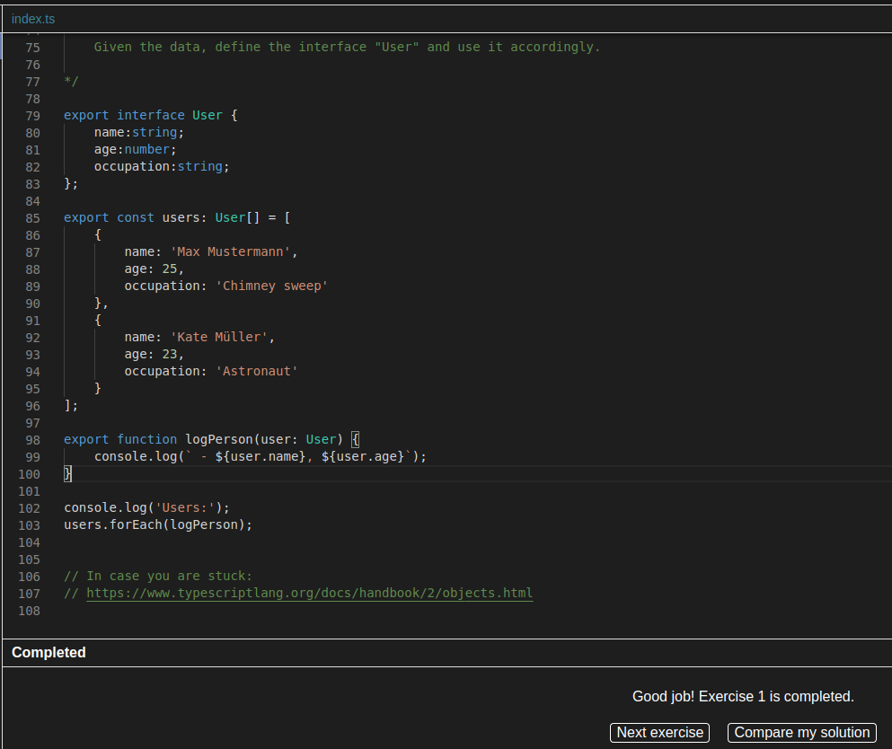
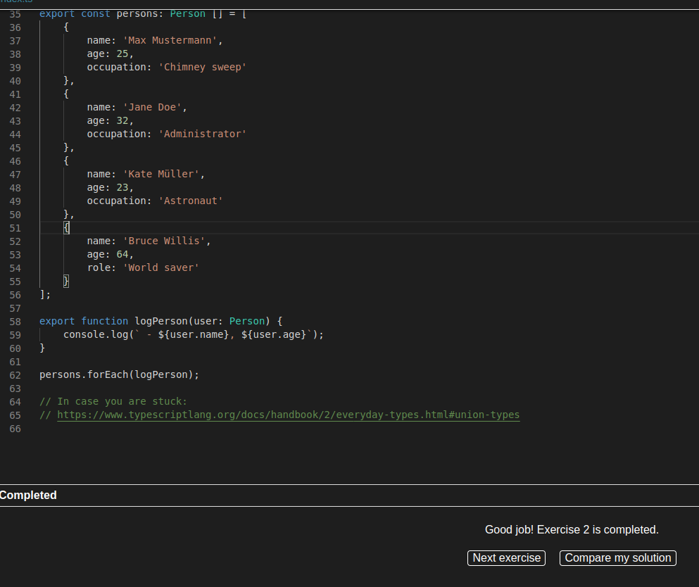

# Workshop 1 Typescript

This is a simple workshop conducted during the class on April 18th, 2024 for Riwi.

## Getting Started 🚀

You can clone this repository to your local machine.

### Prerequisites 📋

- Node Js
- Typescript
- IDE (Visual Studio Code recommended)

### Installation 🔧

Download NodeJs on your computer.
Open the IDE.
Open the terminal.
Run the command: npm init -y
Run the command: npm i typescript
Clone the repository.

## Running ⚙️

To execute the different files, you must locate yourself in the root and execute the file you want to view:
 - node <filename>.js

The result will be displayed on the console.

## Exercises

## Authors ✒️

* **Manuela Torres** - *Initial work* - [manutorres93]((https://github.com/manutorres93))

---
⌨️ Template by: [Villanuevand](https://github.com/Villanuevand) 😊

